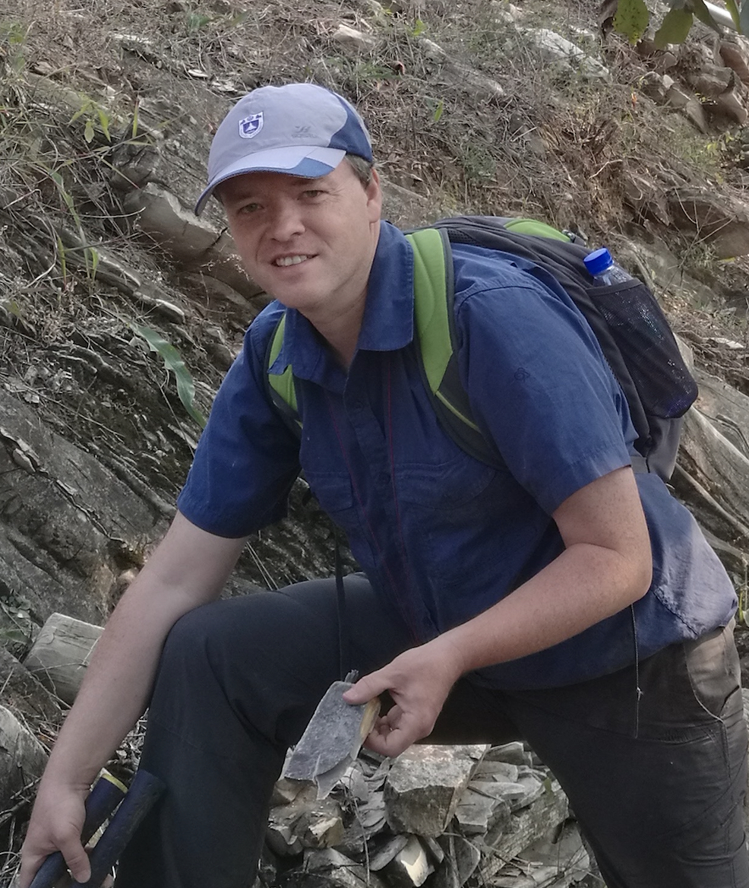

# Graham Shields

Graham Shields is Professor of Geology at University College London, where he teaches geochemistry. Educated in London and Zurich, he has studied Cryogenian and Ediacaran geology across Western Europe, Northwest Africa, China, Mongolia, and Australia. His research focuses on the evolution of the integrated Earth system at pivotal moments in deep time, including the Cambrian explosion and the Snowball Earth glaciations. His 2024 book, [Born of Ice and Fire: How Glaciers and Volcanoes (and a Pinch of Salt) Drove Animal Evolution](https://yalebooks.co.uk/book/9780300242591/born-of-ice-and-fire/), weighs the evidence for Snowball Earth and asks how this extraordinary event helped pave the way for greater biological complexity.

{fig-align="center" width="50%"}
